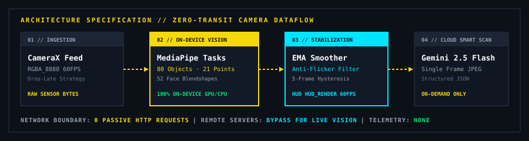

<div align="center">



<br/><br/>

<table>
  <tr>
    <td bgcolor="#121820" align="center"><b><font color="#94A3B8">&nbsp;SYSTEM&nbsp;</font></b></td>
    <td bgcolor="#F5D90A" align="center"><b><font color="#0C1017">&nbsp;OPERATIONAL&nbsp;</font></b></td>
    <td>&nbsp;</td>
    <td bgcolor="#121820" align="center"><b><font color="#94A3B8">&nbsp;NETWORK STREAM&nbsp;</font></b></td>
    <td bgcolor="#F5D90A" align="center"><b><font color="#0C1017">&nbsp;0 BYTES&nbsp;</font></b></td>
    <td>&nbsp;</td>
    <td bgcolor="#121820" align="center"><b><font color="#94A3B8">&nbsp;INFERENCE&nbsp;</font></b></td>
    <td bgcolor="#00E5FF" align="center"><b><font color="#0C1017">&nbsp;ON-DEVICE&nbsp;</font></b></td>
    <td>&nbsp;</td>
    <td bgcolor="#121820" align="center"><b><font color="#94A3B8">&nbsp;GESTURES&nbsp;</font></b></td>
    <td bgcolor="#F5D90A" align="center"><b><font color="#0C1017">&nbsp;9 CANONICAL&nbsp;</font></b></td>
  </tr>
</table>

<br/>

<p align="center">
  <b>Free, high-performance, client-side computer vision &amp; multimodal reasoning.</b><br/>
  <i>Everything executes directly inside local device memory &mdash; no video feeds or telemetry are ever uploaded.</i>
</p>

<p align="center">
  <a href="#-key-highlights"><b>Explore Features</b></a> &bull;
  <a href="#-architecture--dataflow"><b>Architecture</b></a> &bull;
  <a href="#-gesture-matrix"><b>Gesture Matrix</b></a> &bull;
  <a href="#-smart-scan-deep-reasoning"><b>Smart Scan</b></a> &bull;
  <a href="#-getting-started--installation"><b>Install APK</b></a>
</p>

</div>

---

## ⚡ Key Highlights

* 🔒 **100% On-Device Processing**: Images and video feeds never cross the wire. Hand landmarks, facial blendshapes, and 80+ object classes run strictly on local CPU/GPU using Google MediaPipe Tasks Vision.
* ⚡ **Zero Round-Trip Latency**: Instantaneous execution leveraging native hardware acceleration (30–60 FPS camera preview) without cloud network queue bottlenecks.
* 📐 **Neo-Brutalist HUD Engineering**: Sharp cyberpunk reticles, rounded neon-cyan bounding boxes, 1–2px structural borders, and hard offset text shadows.
* 🎯 **Temporal EMA Anti-Jitter**: Bounding box coordinates and category labels are stabilized via Exponential Moving Average (EMA) and 5-frame hysteresis, eliminating label flicker.
* 🎭 **Ethical Facial Expression Tracking**: Certified physical visible expression mapping (Smiling 😊, Surprised 😮, Frowning 🙁, Neutral 😐) with strict `no-psychological-diagnosis` boundaries.
* 🧠 **On-Demand Multimodal Reasoning**: Cloud reasoning with Gemini 2.5 Flash only triggers when the user intentionally taps **✨ SMART SCAN**, with automatic offline heuristic fallback.

---

## 🏗️ Architecture & Dataflow

Traditional computer-vision apps stream entire continuous camera feeds across public networks to remote GPU clusters, incurring severe bandwidth, privacy, and latency liabilities. **Pocket Vision** eliminates the transit liability entirely through local edge execution:

<div align="center">
  
</div>

<br/>

### Dataflow Stages:
1. **01 // Ingestion**: AndroidX CameraX feeds raw RGBA frames into an asynchronous buffer using `STRATEGY_KEEP_ONLY_LATEST`, preventing any preview stutter.
2. **02 // On-Device Vision**: MediaPipe Tasks Vision executes object detection (`efficientdet_lite0`), 21-point hand tracking (`gesture_recognizer`), and 52 facial blendshapes (`face_landmarker`).
3. **03 // Stabilization**: Coordinate smoother filters jitter; HUD overlay paints smooth bounding boxes and gesture banners.
4. **04 // Smart Scan**: When requested, a single compressed frame is dispatched to the FastAPI gateway for fine-grained breed, species, or object reasoning.

---

## 🎮 Gesture Matrix

Pocket Vision tracks 21 skeletal hand coordinates and evaluates finger curl vectors alongside machine learning classifiers:

| Gesture | Icon | Trigger Geometry & Landmark Heuristics | Confidence Target |
| :--- | :---: | :--- | :---: |
| **Peace / Victory** | ✌️ | Index & Middle extended in V-formation, Ring & Pinky curled | > 90% |
| **Thumbs Up** | 👍 | Thumb pointing upwards, 4 fingers curled tightly into palm | > 90% |
| **Thumbs Down** | 👎 | Thumb inverted downwards, 4 fingers curled into palm | > 90% |
| **Open Palm** | ✋ | All 5 digits fully extended and separated | > 92% |
| **Closed Fist** | ✊ | All digits folded inward across metacarpals | > 92% |
| **Pointing Up** | ☝️ | Index digit extended vertical, remaining digits curled | > 90% |
| **I Love You** | 🤟 | Thumb, Index, and Pinky extended, Middle & Ring folded | > 88% |
| **OK Sign** | 👌 | Thumb tip & Index tip Euclidean distance < 0.065, other 3 digits extended | > 90% |
| **Rock / Horns** | 🤘 | Index & Pinky extended vertical, Middle & Ring tips curled into palm | > 92% |

---

## ✨ Smart Scan (Deep Reasoning)

When pointing at unusual animals, specific breeds, or complex environments, tap **✨ SMART SCAN**:

```
╭────────────────────────────────────────────────────────╮
│ ✨ SMART SCAN RESULT                                   │
│                                                        │
│ DOG                                                    │
│ Likely: Golden Retriever                               │
│ 94% Confidence                                         │
│                                                        │
│ Visual Description:                                    │
│ A golden-colored retriever standing outdoors on lawn   │
│ near a tree with a visible collar.                     │
│                                                        │
│ [grass] [tree] [collar] [outdoor]                      │
│                                                        │
│                      [ DISMISS ]                       │
╰────────────────────────────────────────────────────────╯
```

---

## 🛠️ Getting Started & Installation

### Option 1: Direct APK Installation (Fastest)

If you have an Android device or emulator connected via USB/ADB:

```powershell
# Build and install the debug APK
cd mobile
.\gradlew.bat assembleDebug
adb install -r app\build\outputs\apk\debug\app-debug.apk
```

The APK will launch directly with complete offline perception models bundled!

---

### Option 2: Running the Smart Scan Backend

1. **Navigate to the backend directory**:
   ```bash
   cd backend
   ```

2. **Create and activate a virtual environment**:
   ```bash
   python -m venv venv
   # Windows:
   .\venv\Scripts\activate
   # Linux/macOS:
   source venv/bin/activate
   ```

3. **Install dependencies**:
   ```bash
   pip install -r requirements.txt
   ```

4. **Configure environment variables**:
   ```bash
   cp .env.example .env
   ```
   *(Optional: Add your `GEMINI_API_KEY` to `.env` for cloud multimodal vision).*

5. **Start the FastAPI server**:
   ```bash
   uvicorn main:app --reload --host 0.0.0.0 --port 8000
   ```
   * Interactive API docs: `http://localhost:8000/docs`
   * Health endpoint: `http://localhost:8000/health`

---

## 🔒 Privacy & Security Standards

* **Zero Passive Streaming**: Pocket Vision **never** streams video feeds to the cloud. Live perception (objects, gestures, faces) is computed 100% locally on the phone CPU/GPU.
* **On-Demand Dispatch**: High-resolution frames are only transmitted when the user explicitly taps `✨ SMART SCAN`.
* **Credential Isolation**: No secret API keys or credentials exist in the mobile APK.
* **Ethical Vision Boundaries**: Evaluates physical visible expressions (Smiling, Surprised, Neutral, Frowning). It never attempts speculative psychological profiling or identity tracking.

---

## 📂 Repository Structure

```text
Pocket_Vision/
├── docs/                             # Animated SVG diagrams & architecture
│   ├── hero-banner.svg               # Animated Cyberpunk HUD banner
│   ├── architecture-flow.svg         # Animated Dataflow architecture
│   └── architecture.md
├── mobile/                           # Native Android application
│   ├── app/
│   │   ├── src/main/
│   │   │   ├── assets/               # Bundled MediaPipe models (.tflite, .task)
│   │   │   │   ├── efficientdet_lite0.tflite
│   │   │   │   ├── gesture_recognizer.task
│   │   │   │   └── face_landmarker.task
│   │   │   ├── java/com/pocketvision/app/
│   │   │   │   ├── MainActivity.kt
│   │   │   │   ├── camera/           # CameraX manager & lifecycle controls
│   │   │   │   ├── vision/           # MediaPipe helpers, smoother & coordinator
│   │   │   │   ├── network/          # Smart Scan HTTP client
│   │   │   │   ├── speech/           # Text-To-Speech engine
│   │   │   │   └── ui/               # Compose screens, HUD & dialogs
│   │   │   └── res/                  # App drawables, colors, strings
│   │   └── build.gradle.kts
│   ├── gradle/
│   ├── build.gradle.kts
│   ├── settings.gradle.kts
│   └── gradlew.bat
├── backend/                          # FastAPI Smart Scan server
│   ├── main.py                       # Gateway endpoints (/health, /api/v1/analyze)
│   ├── vision/                       # Multimodal analyzer & Pydantic schemas
│   ├── requirements.txt
│   ├── .env.example
│   └── README.md
├── scripts/                          # Model download & verification scripts
│   ├── download_models.py
│   └── verify_environment.py
├── .gitignore
└── README.md
```

---

<div align="center">
  <sub>Engineered with precision for mobile computer vision. Built by <a href="https://github.com/NvxStrikes">NvxStrikes</a>.</sub>
</div>
