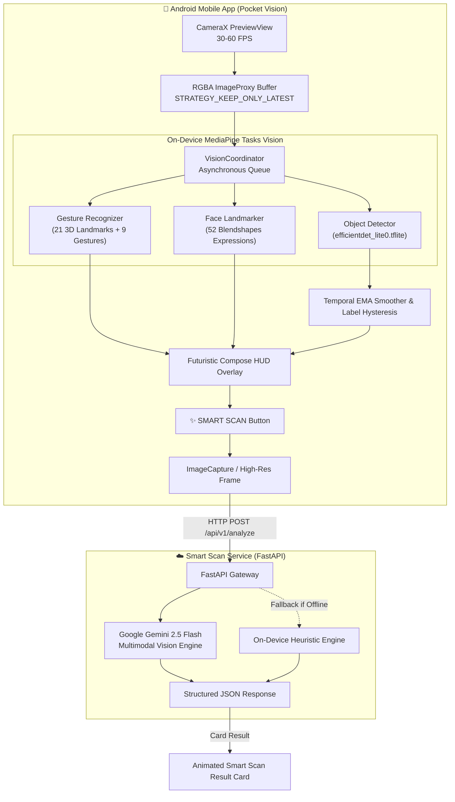

<div align="center">

# 👁️ POCKET VISION 📱
### *Next-Gen Real-Time Mobile Computer Vision & Multimodal Perception*

[-3DDC84?style=for-the-badge&logo=android&logoColor=white)](https://developer.android.com)
[](https://kotlinlang.org)
[](https://developer.android.com/jetpack/compose)
[](https://developers.google.com/mediapipe)
[](https://fastapi.tiangolo.com)
[](LICENSE)

<p align="center">
  <b>Point. Detect. Understand.</b><br>
  A cybernetic, lightweight mobile computer-vision camera app capable of seeing the real world,<br>
  intelligently recognizing objects, people, hand gestures, and visible facial expressions in real time—all on-device.<br>
  Powered by an on-demand cloud <b>✨ Smart Scan</b> for deep species, breed, and scene identification.
</p>

---

```
╭────────────────────────────────────────────────────────╮
│  POCKET VISION                                  ● LIVE │
│                                                        │
│             ┌─────────────────────────┐                │
│             │         PERSON          │                │
│             │          98%            │                │
│             └─────────────────────────┘                │
│                                                        │
│              😊 Expression: Smiling                    │
│                                                        │
│                    ✌️ PEACE (95%)                      │
│                                                        │
│       ┌───────────────────────┐                        │
│       │     WATER BOTTLE      │                        │
│       │         94%           │                        │
│       └───────────────────────┘                        │
│                                                        │
│                 [ ✨ SMART SCAN ]                       │
╰────────────────────────────────────────────────────────╯
```

</div>

---

## 🚀 Key Highlights

<table>
  <tr>
    <td width="50%">
      <h3>⚡ Real-Time On-Device Perception</h3>
      <ul>
        <li><b>80+ Object Categories</b>: Detects bottles, laptops, cups, chairs, vehicles, animals, and backpacks instantly.</li>
        <li><b>Temporal Stabilization</b>: Exponential Moving Average (EMA) coordinate smoothing stops box jittering and flickering.</li>
        <li><b>30–60 FPS Preview</b>: Camera preview never drops frames; decoupled asynchronous inference runs at 10–15 FPS.</li>
      </ul>
    </td>
    <td width="50%">
      <h3>🖐️ Hand & Gesture Intelligence</h3>
      <ul>
        <li><b>21 3D Landmarks</b>: Real-time hand skeletal tracking.</li>
        <li><b>9 Common Gestures</b>: Peace ✌️, Thumbs Up 👍, Thumbs Down 👎, Open Palm ✋, Closed Fist ✊, Pointing ☝️, I Love You 🤟, OK Sign 👌, Rock/Horns 🤘.</li>
        <li><b>Hybrid Geometry</b>: Combines built-in models with landmark vector angles for custom gestures.</li>
      </ul>
    </td>
  </tr>
  <tr>
    <td width="50%">
      <h3>🎭 Visible Facial Expressions</h3>
      <ul>
        <li><b>52 ARKit Blendshapes</b>: Evaluates muscle action units in real time.</li>
        <li><b>Physical Expressions</b>: Smiling 😊, Surprised 😮, Frowning 🙁, and Neutral 😐.</li>
        <li><b>Ethical Boundaries</b>: Strictly describes physical visible expressions without speculating on psychological states.</li>
      </ul>
    </td>
    <td width="50%">
      <h3>✨ Smart Scan (Deep Reasoning)</h3>
      <ul>
        <li><b>Multimodal Reasoning</b>: Tap <i>✨ SMART SCAN</i> to capture high-res frame and invoke deep vision analysis.</li>
        <li><b>Fine-Grained Classification</b>: Pinpoints specific breeds, species, and brands (e.g. <i>"Likely Golden Retriever"</i>).</li>
        <li><b>Offline Resilience</b>: Seamlessly falls back to on-device heuristic deep reasoning when offline.</li>
      </ul>
    </td>
  </tr>
</table>

---

## 🎮 Gesture Matrix

Pocket Vision tracks 21 skeletal hand coordinates and applies vector geometry rules alongside neural classification:

| Gesture | Icon | Trigger Geometry & Landmark Heuristics | Confidence Target |
| :--- | :---: | :--- | :---: |
| **Peace / Victory** | ✌️ | Index & Middle extended in V-formation, Ring & Pinky locked by Thumb | > 90% |
| **Thumbs Up** | 👍 | Thumb pointing upwards, 4 fingers curled tightly into palm | > 90% |
| **Thumbs Down** | 👎 | Thumb inverted downwards, 4 fingers curled | > 90% |
| **Open Palm** | ✋ | All 5 digits fully extended and separated | > 92% |
| **Closed Fist** | ✊ | All digits folded inward across metacarpals | > 92% |
| **Pointing Up** | ☝️ | Index digit extended vertical, remaining digits curled | > 90% |
| **I Love You** | 🤟 | Thumb, Index, and Pinky extended, Middle and Ring folded | > 88% |
| **OK Sign** | 👌 | Thumb tip & Index tip Euclidean distance < 0.065, Middle/Ring/Pinky extended | > 90% |
| **Rock / Horns** | 🤘 | Index & Pinky extended vertical, Middle & Ring tips folded inward | > 92% |

---

## 🏛️ System Architecture



---

## 📱 Mobile Application Tech Stack

* **Language**: Kotlin 1.9.24
* **UI Toolkit**: Jetpack Compose (Material 3) + Edge-to-Edge System Bars
* **Camera Framework**: AndroidX CameraX (`1.3.4`)
* **On-Device Vision Models**:
  * `efficientdet_lite0.tflite` (COCO 80 categories)
  * `gesture_recognizer.task` (21 hand landmarks + gesture embeddings)
  * `face_landmarker.task` (478 3D landmarks + 52 ARKit blendshapes)
* **Networking**: OkHttp3 + Gson
* **Audio**: Android Text-To-Speech (TTS) with rate-limiting & cooldown

---

## ☁️ Backend Service Tech Stack

* **Framework**: FastAPI + Uvicorn (ASGI)
* **Language**: Python 3.11+
* **Validation**: Pydantic v2
* **Image Processing**: Pillow (PIL)
* **AI Provider**: Google GenAI SDK (Gemini 2.5 Flash) with fallback mock heuristics

---

## 🛠️ Getting Started & Installation

### Option 1: Direct APK Installation (Fastest)

If you have an Android device or emulator connected via USB/ADB:

```powershell
# Build and install the debug APK
cd mobile
.\gradlew.bat assembleDebug
adb install -r app\build\outputs\apk\debug\app-debug.apk
```

The APK will launch directly with complete offline perception models bundled!

---

### Option 2: Running the Smart Scan Backend

1. **Navigate to the backend directory**:
   ```bash
   cd backend
   ```

2. **Create and activate a virtual environment**:
   ```bash
   python -m venv venv
   # Windows:
   .\venv\Scripts\activate
   # Linux/macOS:
   source venv/bin/activate
   ```

3. **Install dependencies**:
   ```bash
   pip install -r requirements.txt
   ```

4. **Configure environment variables**:
   ```bash
   cp .env.example .env
   ```
   *(Optional: Add your `GEMINI_API_KEY` to `.env` for real-time cloud analysis).*

5. **Start the FastAPI server**:
   ```bash
   uvicorn main:app --reload --host 0.0.0.0 --port 8000
   ```
   * Access interactive Swagger docs at `http://localhost:8000/docs`
   * Check health at `http://localhost:8000/health`

---

## 🔒 Privacy, Security & Ethics

* **Zero Passive Streaming**: Pocket Vision **never** streams video feeds to the cloud. Live perception (objects, gestures, faces) is computed 100% locally on the phone CPU/GPU.
* **On-Demand Smart Scan**: High-resolution frames are only transmitted when the user explicitly taps `✨ SMART SCAN`.
* **Credential Isolation**: No secret API keys or credentials are baked into the mobile APK. All AI service calls are proxied through the backend.
* **Ethical Vision Boundaries**: Pocket Vision classifies observable physical facial expressions (Smiling, Surprised, Neutral, Frowning). It never attempts speculative psychological profiling or biometric identity verification.

---

## 📂 Repository Structure

```text
Pocket_Vision/
├── mobile/                           # Native Android application
│   ├── app/
│   │   ├── src/main/
│   │   │   ├── AndroidManifest.xml
│   │   │   ├── assets/               # Bundled MediaPipe models (.tflite, .task)
│   │   │   │   ├── efficientdet_lite0.tflite
│   │   │   │   ├── gesture_recognizer.task
│   │   │   │   └── face_landmarker.task
│   │   │   ├── java/com/pocketvision/app/
│   │   │   │   ├── MainActivity.kt
│   │   │   │   ├── camera/           # CameraX manager & lifecycle controls
│   │   │   │   ├── vision/           # MediaPipe helpers, smoother & coordinator
│   │   │   │   ├── network/          # Smart Scan HTTP client
│   │   │   │   ├── speech/           # Text-To-Speech engine
│   │   │   │   └── ui/               # Compose screens, HUD & dialogs
│   │   │   └── res/                  # App drawables, colors, strings
│   │   └── build.gradle.kts
│   ├── gradle/
│   ├── build.gradle.kts
│   ├── settings.gradle.kts
│   └── gradlew.bat
├── backend/                          # FastAPI Smart Scan server
│   ├── main.py                       # Gateway endpoints (/health, /api/v1/analyze)
│   ├── vision/                       # Multimodal analyzer & Pydantic schemas
│   ├── requirements.txt
│   ├── .env.example
│   └── README.md
├── scripts/                          # Model download & verification scripts
│   ├── download_models.py
│   └── verify_environment.py
├── docs/
│   └── architecture.md
├── .gitignore
└── README.md
```

---

<div align="center">
  <sub>Engineered with precision for mobile vision exploration. Built by <a href="https://github.com/NvxStrikes">NvxStrikes</a>.</sub>
</div>
